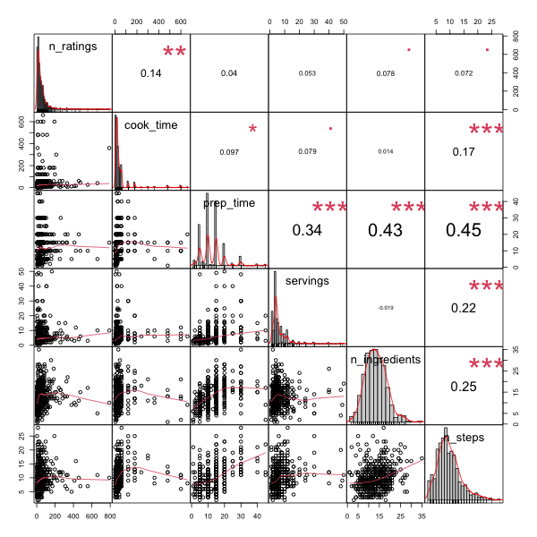

# Predicting Popularity of Recipes from Recipetin Eats

### Emma Crenshaw, Carmen Rodriguez, Aiza Malik, Ligia Flores

## Project Overview

It can be hard to judge the quality of online recipes without trying them as a home chef, and it can be hard as a content creator to determine how to best market your recipes. We want to determine if we can predict the popularity of online recipes with just the easily quantifiable information provided with most recipes, such as number of ingredients, cook time, and number of recipe steps. This could allow users to better identify aspects of a recipe that may make it a better choice and could help content-creators finetune their recipe creation.

## Objective

Determine how well we can predict the popularity of a recipe (i.e., number of reviews) based on the easily ‘seen’ aspects of a recipe (i.e., number of ingredients, time it takes to make, etc) and create an algorithm to help recipe creators predict whether a recipe will be popular.

##  Data and Approach

We conducted web scraping  from [RecipetinEats](https://www.recipetineats.com/), taking data from every recipe on the website.
After performing quality checks of the data and data cleaning, we conducted exploratory analysis to examine which recipe features were associated with recipe popularity defined as number of ratings.  We fitted a Random Forest regression to predict recipe popularity (number of ratings) of the recipe based on all other features on the dataset, a decision tree regression and  visualizations to see which recipes were most popular based on cuisine.

## Analysis

### Exploratory Analysis 

Using the training set we made some plots to help assess the relationship between recipe popularity  `n_ratings`, and each of the other features of interest in the data set. 

Looking at the scatterplots we do not see any relationship patterns between recipe popularity and any of features. Through further assessment using correlations, we noted that only recipe cook time  had a significant adequate correlation with recipe popularity.

### Exploring Recipe popularity by Cuisine 

We next wanted to explore recipe popularity by cuisine. We categorized this as: 1) European/Western, 2) Americanized_cultural_food,3) Asian, 4) Australian,5) French,6) Indian,7) Italian,8) Mediterranean,9) Mexican, 10) Middle Eastern, 11) South American/Caribbean, and 12) Other which includes categories of dog food, holidays, and categories not in particular to regions. 

As shown above, in terms of the most popular cuisine category, the European/Western category has the highest number  of ratings compared to the other cuisine categories. 

Here we see there is a significance between the different types of cuisines and number of ratings but it is not enough for us to say the category/type of cuisine is a predictor for popularity of recipe. 

Additionally, we decided to visualize which cuisines, grouped by country, are the most interacted with (have the most ratings) and which ones are most common (number of recipes of a specific cuisine).

The most common cuisine entries in order are: Mexican, Italian, Chinese, Thai, French, Indian, Greek, Vietnamese, American and Japanese.

The most interacted-with cuisine entries in order are: Thai, Mexican, Chinese, Indian, Italian, Greek, Vietnamese, French, American, Japanese.

Based on these preliminary findings we conducted regression analyses using decision trees and random forest regression.

### Decision Tree Results

Firstly, we predicted recipe popularity by fitting a decision tree regression.
For the purpose of the project, predictors of interest included: prep time, cook time, number of steps, number of ingredients, and servings.

From preliminary analysis (by a multivariate linear regression model), we further confirmed that cook time is significantly associated with recipe popularity.

Fitting the decision tree model that predicts `n_ratings` using cook time,prep time,servings, number of ingredients, and number of steps in the training data, resulted in the following  tree:

The tree suggests that the recipes with higher cook time corresponds to higher total number of ratings and includes the variable that we identified as being significant in the linear regression model, and number of steps and number of ingredients. We re-fitted the decision tree  including the cuisine type variable and there were no differences in the results.

###  Random Forest Results

We conducted Random Forest regression to predict recipe popularity (number of ratings) of the recipe based on other features: cook time,prep time,servings, number of ingredients, and number of steps. Results are summarized below.

-  Error rate of the full model stabilized with around 200 trees but continues to decrease slowly until around 300 or so trees.

- The two most predictive variables as determined by their Gini coefficient were: cook time and number of ingredients. Reducing the model to only include important variables decreased the mean square error from  6098 to 5517.

- Overall, the model did not perform well in the test set. This is because predictors were uncorrelated with recipe popularity `n_ratings`. Therefore, the random forest algorithm  was forced to choose amongst only "noise" variables at many of its splits leading to poor performance.

### Screencast Video 

[Screencast](https://www.youtube.com/watch?v=JBXcXrkLHwA)

