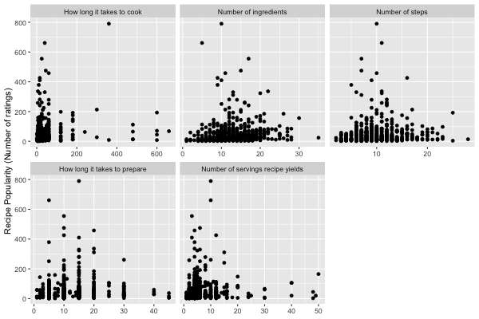

# Predicting Popularity of Recipes from Recipetin Eats

### Emma Crenshaw, Carmen Rodriguez, Aiza Malik, Ligia Flores

## Project Overview

It can be hard to judge the quality of online recipes without trying them as a home chef, and it can be hard as a content creator to determine how to best market your recipes. We want to determine if we can predict the popularity of online recipes with just the easily quantifiable information provided with most recipes, such as number of ingredients, cook time, and number of recipe steps. This could allow users to better identify aspects of a recipe that may make it a better choice and could help content-creators finetune their recipe creation.

## Objective

Determine how well we can predict the popularity of a recipe (i.e., number of reviews) based on the easily ‘seen’ aspects of a recipe (i.e., number of ingredients, time it takes to make, etc) and create an algorithm to help recipe creators predict whether a recipe will be popular.

##  Data and Approach

We conducted web scraping  from [RecipetinEats](https://www.recipetineats.com/), taking data from every recipe on the website.
After performing quality checks of the data and data cleaning, we conducted exploratory analysis to examine which recipe features were associated with recipe popularity defined as number of ratings.  We fitted a Random Forest regression to predict recipe popularity (number of ratings) of the recipe based on all other features on the dataset, a decision tree regression and  visualizations to see which recipes were most popular based on cuisine.

The variables available are described below:

  - **recipe**: Name of the recipe
  - **cook_time**: Amount of time the recipe takes to actively cook (minutes)
  - **prep_time**: Amount of preparation time the recipe takes (minutes)
  - **course**: Course of the recipe (ex: main)
  - **cuisine**: Type of cuisine. This could be a single string or a list
  - **rating**: The average rating of the recipe from 1-5
  - **n_ratings**: The number of ratings the recipe has
  - **servings**: Number of servings the recipe yields
  - **ingredients**: List of ingredients used in the recipe, separated by a semicolon
  - **n_ingredients**: Number of ingredients
  - **n_steps**: Number of steps in the recipe
  - **calories**: Number of calories per serving in the recipe
  - **carbs**: Number of grams of carbohydrates per serving 
  - **protein**: Grams of protein per serving
  - **fat**: Grams of total fat per serving
  - **sat_fat**: Grams of saturated fat per serving
  - **poly_fat**: Grams of polyunsaturated fat per serving
  - **mono_fat**: Grams of monounsaturated fat per serving
  - **sodium**: mg of sodium per serving
  - **potassium**: mg of potassium per serving
  - **fiber**: Grams of fiber per serving
  - **sugar**: Grams of sugar per serving
  - **vitamin_c**: mg of vitamin A per serving
  - **vitamin_a**: international units (IU) of vitamin A per serving
  - **calcium**: mg of calcium per serving
  - **iron**: mg of iron per serving

## Analysis

### Exploratory Analysis 

Using the training set we made some plots to help assess the relationship between recipe popularity  `n_ratings`, and each of the other features of interest in the data set. 

Looking at the scatterplots we do not see any relationship patterns between recipe popularity and any of features. Through further assessment using correlations, we confirmed that none of the features had adequate correlation with recipe popularity `n_ratings`.

### Exploring Recipe popularity by Cuisine 

We next wanted to explore recipe popularity by cuisine. The categories are: 1) European/Western, 2) Americanized_cultural_food,3) Asian, 4) Australian,5) French,6) Indian,7) Italian,8) Mediterranean,9) Mexican, 10) Middle Eastern, 11) South American/Caribbean, and 12) Other which includes categories of dog food, holidays, and categories not in particular to regions.The type of cuisine categories breakdown is explained on the RM file.

As shown above, in terms of the most popular cuisine category, the European/Western category has the most total number of ratings compared to the other cuisine categories. This however is not enough to imply that the type of cuisine plays a factor in predicting popularity in recipes given that the way the website identified the cuisine type of a recipe as Western was general.Let us now explore the type of cuisine variable as a potential predictor.

Here we see there is a significance between the different types of cuisines and number of ratings but it is not enough for us to say the category/type of cuisine is a predictor for popularity of recipe. We will now explore more by fitting a decision tree and linear regression model with and without the cuisine category variable.

We decided to visualize which cuisines, grouped by country, are the most interacted with (have the most ratings) and which ones are most common (number of recipes of a specific cuisine).

The most common cuisine entries in order are: Mexican, Italian, Chinese, Thai, French, Indian, Greek, Vietnamese, American and Japanese

The most interacted-with cuisine entries in order are: Thai, Mexican, Chinese, Indian, Italian, Greek, Vietnamese, French, American, Japanese

### Decision Tree Results

Let us now predict recipe popularity by fitting decision tree model.
For the purpose of the project, predictors of interest would be in terms of convenience (this means including prep time, cook time, number of steps, number of ingredients, servings).

From preliminary analysis (by a linear regression model), we found that that only the coefficient for cook time is significant at a 0.05 threshold.

Now fitting a decision tree model that predicts `n_ratings` using cook time,prep time,servings, number of ingredients, and number of steps in the training data, we get the following decision tree:

The tree suggests that the recipes with higher cook time corresponds to higher total number of ratings and includes the variable that we identified as being significant in the linear model (`n_rating`), plus number of steps and number of ingredients.

Now fitting a decision tree model now including the cuisine type in the training data, we get the following decision tree:

Here we can also see that although we added the new predictor variable cuisine, the significant predictor is still cook time and the variables included in the decision tree has not changed.

###  Random Forest Results

-  Error rate of the full model stabilized with around 200 trees but continues to decrease slowly until around 300 or so trees.

-  Model did not perform well in the test set. This is because predictors were uncorrelated with recipe popularity `n_ratings`. Therefore, the random forest algorithm  was forced to choose amongst only "noise" variables at many of its splits leading to poor performance.

- The two most predictive variables as determined by their Gini coefficient were: cook time and number of ingredients. Reducing the model to only include important variables decreased the mean square error from  6098 to 5517.

### Screencast Video 

